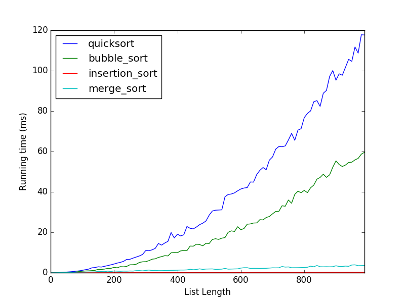
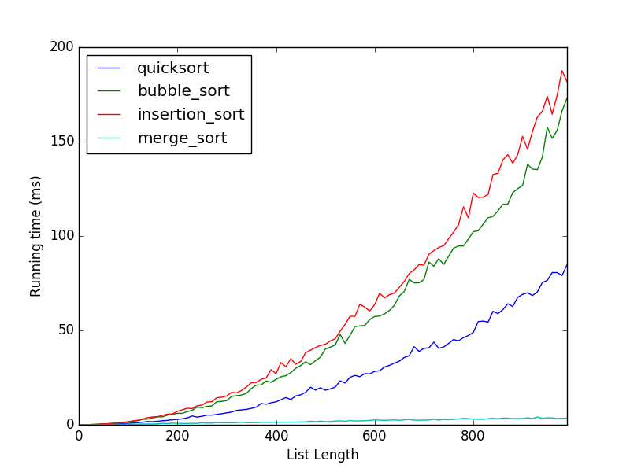
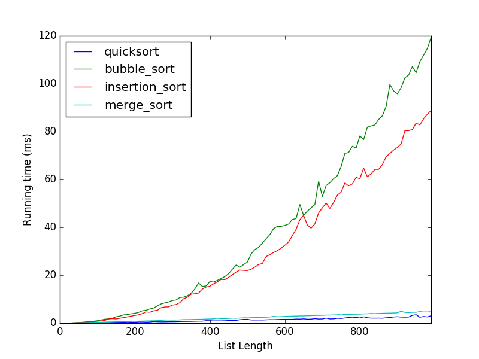
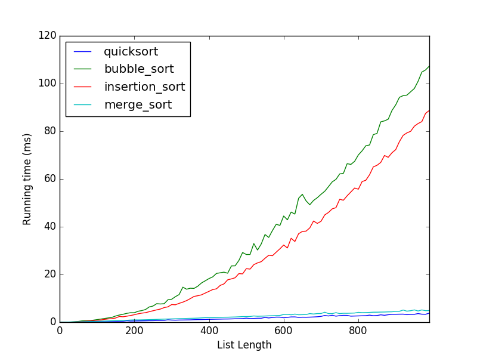

# CS2500 Algorithms project
## Report Author: Nathan Lincoln
### Project collaborator: Rachel Strohkorb

### Problem statement
The sorting problem is far from solved, with several different solutions that perform differently on different inputs. 
In this project, my partner and I seek to compare the performance of 4 different sorting algorithms against 4 different 
types of input.

The 4 implemented algorithms are as follows:
* Quick Sort
* Merge Sort
* Bubble Sort
* Insertion Sort

We compared the running time of these algorithms against four different types of input:
* Sorted list
* Sorted list, but reversed
* Shuffled list with unique elements
* Shuffled list with some duplicates

### Algorithms implemented

#### Quick sort
Quicksort is a divide-and-conquer algorithm, where the list of elements is split into two pieces. Each of those pieces are
sorted by the algorithm until we've reached a base case (in the case of quicksort, where the size of the list is zero).

Quicksort picks a pivot value in the array and moves the value into it's final position into the array. It does this by
moving all list elements _greater_ than the pivot to the "right" in the array, and all _smaller_ elements to the "left".
It then takes the "left" and "right" sides of the array and sorts them using the same algorithm.

The expected running time of quicksort is `O(nlgn)`

#### Merge sort
Merge sort, like quicksort, is a divide and conquer algorithm, but the way it goes about sorting the array is very 
different. Instead of pivoting around a value, merge sort simply cuts the list into two halves and mergesorts the halves
individually. It does this until the size of the array is 1, which is sorted by definition. Once the array is sorted, 
mergesort merges (hence the name) the two sorted halves together by creating a new array with enough space to hold both 
halves, and popping the smallest elements from the front of each half until both are empty.

The expected running time of mergesort is `O(nlgn)`
#### Bubble sort
Bubblesort is slow. It's the tool in the toolchest that you think could _technically_ solve the problem, but there's so 
many other tools that could do the job so much better.

Bubblesort works by moving a "bubble" across the list, considering pairs of elements at a time. If the two elements are 
unsorted, it swaps them, thereby making them sorted. It does this until the list has been sorted. This generally takes 
_n_ passes through the list, given _n_ elements in the list.

The expected running time of bubble sort is `O(n^2)`

#### Insertion sort
At a high level, insertion sort works by maintaining a list of sorted elements, and one-by-one inserting elements of the
unsorted into the sorted list, while still maintaining sorted order. 

Insertions sort works similar to bubble sort, in that it uses swapping to move elements around in the array. Unlike 
bubble sort, it maintains a list of sorted elements, and is therefore able to reduce its list of unsorted elements by 1
with each iteration.

The expected running time of bubble sort is `O(n^2)`, but for pre-sorted lists its running time is `O(n)`

### Solution
We implemented the algorithms in python. We didn't attempt any serious speedups, instead opting to write what would be 
considered clean, idiomatic python. Attached is a folder containing all code used for this project (including testing).

The only 3rd party library used was matplotlib's excellent pyplot module, which was used to create the performance 
graphs

The runtimes for the different algorithms on different inputs is as follows:
#### Sorted List

The results here are interesting. Insertion sort's runtime doesn't seem to grow in the slightest in comparison to the 
other algorithms. Quicksort ends up coming in last here, likely due to the fact that the algorithm runs poorly on uniform
lists
#### Reversed list

Merge sort destroys the competition here. This is interesting, since it doesn't seem like there's any inherent property 
of the algorithm that lends it to this kind of input. I have a (possibly incorrect theory) why merge sort works so well.

First of all, in this scenario, when merge sort merges the two lists, all of the elements in one of the lists will be smaller
than the other. Therefore, the algorithm to select which list to pull elements out of will always select one of the lists.
Modern CPU's have a feature called a branch predictor, where they try to predict the result of a conditional expression.
Since the algorithm consistently picks one list over the other, the branch predictor is able to efficiently optimize
for this scenario.

#### Shuffled list, no duplicates

Quicksort really shows off here, since randomized inputs are the best case scenario for quicksort.

#### Shuffled list, some duplicates

Roughly the same results here as above, It would seem that the number of unique elements in a list doesn't matter much to
quicksort and mergesort.

### Future Work and Conclusion
Future work in the field of sorting can include finding faster algorithms that work well on extremely specialized input.
More future work can be to improve the running time of an algorithm, without reducing it's polynomial complexity. For 
example, while both quicksort and mergesort are both `O(nlgn)`, quicksort generally runs faster than mergesort.
Work can also be done to improve the efficiency of the data structures used in these algorithms. Pythons list implementation
is designed for developer ergonomics instead of raw performance, and swapping out pythons default implementation for a 
faster one could result in a speedup.
